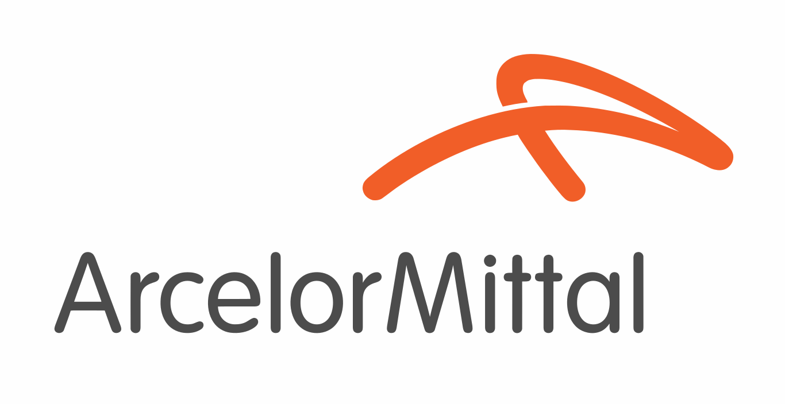

## Team Name: 
<h3 align="center"> 🤖  Man Of Steel  🤖 </h3> <br>


## Project:

<p align="center">
<a href="https://belgium.arcelormittal.com/en" target="blank"></a>

## Developers: 
* <a href="https://github.com/WoutervdVijver" target="blank"></a> 
 <a href="https://github.com/WoutervdVijver"> Wouter van de Vijver <br>
  
* <a href="https://github.com/mohammedbouazzaoui" target="blank"></a> 
 <a href="https://github.com/mohammedbouazzaoui"> Mohammed Bouazzaoui <br>
  
* <a href="https://github.com/saifalbaghdadi" target="blank"></a> 
 <a href="https://github.com/saifalbaghdadi"> Saif Malkshahi <br>
  
  
<br> 
  
## Level:
  
* <strong> Junior Developer </strong> <br>
  
<br>
  
## Organization:
* <a href="https://www.becode.org"><strong>BeCode</strong></a> <strong>Company (Ghent) </strong> <br> 
  <a href="https://www.becode.org" target="blank"></a> <br>
<br>
<br>
<br>
<br>

## The timeline of the project: 
* <strong> 11/04/2022 - 22/04/2022  </strong>
<br>
 
## Project Goal: 
* <strong> Predicting width constrictions during hot rolling. </strong>
<br>


## Type of Challenge: 	
* <strong > Dealing with huge amount of real Data from Production. </strong > 
* <strong > Analysing, cleaning and pre-processing all data files. </strong > 
* <strong > Visualizing data. </strong > 
* <strong > Modelling data using Supervised Machine Learning techniques. </strong > 
* <strong > Predicting width constriction and visualizing it. </strong > 

<br>
 
 ## Dataset:
* <strong >  Main_CoilFile.csv with attributs: <br>
    ( coil,	furnace Number,	analyse,	Hardness_1,	Hardness_2,	Width,	Temperature before finishing mill,	Temperature after finishing mill,	Thickness,	Thickness profile,	c,	mn,	si,	nb,	p,	s,	al,	ma,	b,	n,	ti,	cr,	va,	mo ). </strong > 


* <strong >  More the 57,000 Csv files of each Coil-file with attributs ( Coil Number, Coil Stage, Lengthpoints and Values ). </strong > 

  
<br>
 
## Description:
<h4> ArcelorMittal is a project where we predicted width constrictions by given data from our Client. </h4>

* <strong > We analyzed, cleaned and processed all raw data. </strong >
* <strong > We visualised, recognized  and calculated an error value representing the constriction for each coil . </strong >
* <strong > We combined this information in a single dataframe </strong>
* <strong > From this data we build a model and optimed it </strong>
<br>
  
## Installation and Usage:
* <strong > Put the .csv files with width measurements for each coil in the SignalExport folder.</strong >
* <strong > Put all additional measurements in the CoilData folder. </strong >
* <strong > Run the coil_scorer notebook wich will create a dataframe for all coils with their respective scores. </strong >
* <strong > Then run the correct clean_transform data notebook depending on the choice of score to clean and transform the dataframe. </strong >
* <strong > At last run the ML-model notebook to create the model.  </strong >
 
## Used Language and Libraries:
* <strong> To install one of the Libraries , write in the terminal : </strong>
  <h4 align="center"> pip install " Library name " </h4>
 
  
```
└── Python
      ├── Numpy   
      ├── Pandas
      ├── Matplotlib
      ├── Seaborn
      ├── Sklearn
      ├── Joblib
      ├── Typing
      └── Os   
       
     
     
```

